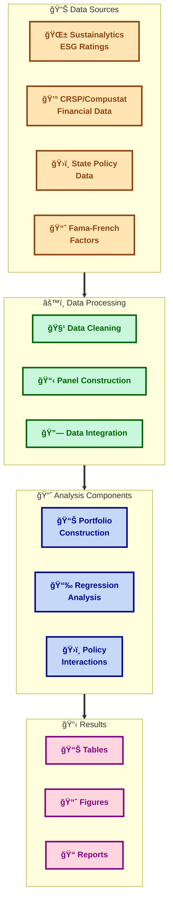
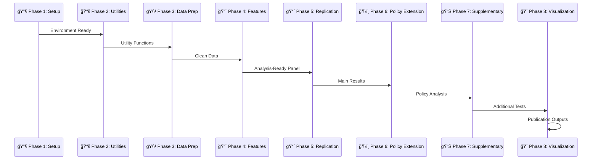

# ESG Rating Changes and Stock Returns: A State Policy Analysis 📊🏛️📈

[](https://github.com/pollywhiten/esg_dissertation_project)
[](https://www.r-project.org/)
[](https://rstudio.github.io/renv/)
[](https://www.tidyverse.org/)
[](https://cran.r-project.org/package=plm)
[](./#environment-status)
[](./#testing)
[](./LICENSE)

<div align="center">
  
  
  **Masters Dissertation Project**  
  **King's College London**  
  **Pollyanna Whitenburgh**
</div>

---

A comprehensive replication and extension study examining how state-level environmental policies moderate stock market reactions to ESG rating changes, using advanced panel regression techniques and portfolio analysis methods.

## 📑 Table of Contents

- [🎯 Project Overview](#-project-overview)
  - [Research Objectives](#research-objectives)
  - [Key Contributions](#key-contributions)
- [🏗️ Project Architecture](#️-project-architecture)
- [🔄 Analysis Pipeline](#-analysis-pipeline)
- [🛠️ Technology Stack](#️-technology-stack)
- [📊 Development Status](#-development-status)
- [📁 Project Structure](#-project-structure)
- [🚀 Setup & Installation](#-setup--installation)
- [🧪 Testing](#-testing)
- [📈 Analysis Components](#-analysis-components)
- [📚 Methodology](#-methodology)
- [📜 License](#-license)
- [🤝 Contributing](#-contributing)
- [🙏 Acknowledgments](#-acknowledgments)

## 🎯 Project Overview

This dissertation project conducts a comprehensive analysis of Environmental, Social, and Governance (ESG) rating changes and their impact on stock returns, with a particular focus on how state-level environmental policies moderate these effects.

### Research Objectives

The study addresses three primary research questions:

1. **Replication Analysis**: Do ESG rating changes significantly impact stock returns, confirming findings from Shanaev & Ghimire (2022)?

2. **Policy Moderation**: How do state-level environmental policies (ACEEE rankings, RPS policies) moderate the relationship between ESG rating changes and stock returns?

3. **Temporal Analysis**: Have these relationships changed over time, particularly in the post-2016 period?

### Key Contributions

- **Methodological Rigor**: Full replication of existing research with transparent, reproducible R code
- **Policy Integration**: Novel incorporation of state-level environmental policy data
- **Temporal Analysis**: Comprehensive subsample analysis across different time periods
- **Open Science**: Complete codebase and documentation for research transparency

## 🏗️ Project Architecture

The project follows a modular architecture with specialized components:



## 🔄 Analysis Pipeline

The research follows a systematic 8-phase pipeline:



## 🛠️ Technology Stack

### Core Environment
- **R 4.5.1+** (Statistical computing and analysis)
- **renv 1.1.4** (Reproducible package management)
- **RStudio** (Recommended IDE)

### Key R Packages
- **Data Manipulation**: `tidyverse` (2.0.0+), `data.table` (1.17.8+), `lubridate` (1.9.4+)
- **Econometrics**: `plm` (2.6.6+), `sandwich` (3.1.1+), `lmtest` (0.9.40+)
- **Visualization**: `ggplot2` (3.5.2+), `ggthemes` (5.1.0+), `patchwork` (1.3.1+)
- **Tables**: `stargazer` (5.2.3+), `gt` (1.0.0+), `knitr` (1.50+)
- **File I/O**: `readxl` (1.4.5+), `writexl` (1.5.4+), `haven` (2.5.5+)

### Development Tools
- **Version Control**: Git with GitHub
- **Documentation**: R Markdown, roxygen2
- **Testing**: Custom test suite with validation
- **Reproducibility**: renv lock files, Docker support

## 📊 Development Status

### ✅ **Completed Phases:**

| Phase | Component | Status | Progress |
|-------|-----------|--------|----------|
| **🔧 Phase 1** | Environment Setup | ✅ Complete | 100% |
| | R Installation & Configuration | ✅ | 100% |
| | Package Installation (21 packages) | ✅ | 100% |
| | renv Reproducibility Setup | ✅ | 100% |
| | Project Structure Verification | ✅ | 100% |
| **📚 Phase 2** | Utility Functions | ✅ Complete | 100% |
| | Date Alignment Utils | ✅ | 100% |
| | Forward Fill Functions | ✅ | 100% |
| | Panel Construction | ✅ | 100% |
| | Weighted Average Functions | ✅ | 100% |
| | Regression Functions | ✅ | 100% |
| | Plotting Themes | ✅ | 100% |
| **🧹 Phase 3** | Data Preparation | 🟡 In Progress | 33% |
| | Clean Sustainalytics ESG Data | ✅ | 100% |
| | Process Reference Data | ✅ | 100% |
| | Clean Financial Data | ⏳ Pending | 0% |
| | Process Fama-French Factors | ⏳ Pending | 0% |
| | Clean Policy Data | ⏳ Pending | 0% |
| | Validate Data Quality | ⏳ Pending | 0% |

### 🎯 **Current Focus:**

- **Phase 3**: Data preparation and cleaning pipeline implementation (33% complete)
- **ESG Data Processing**: Successfully cleaned Sustainalytics data (25M+ records)
- **Reference Mapping**: Created static EntityId-to-CUSIP linkage (92% coverage)
- **Next Steps**: Financial data (CRSP/Compustat) and Fama-French factor processing

### 📋 **Next Steps:**

Continuing Phase 3 data preparation pipeline:

- **Phase 3.3**: Clean CRSP/Compustat financial data
- **Phase 3.4**: Process Fama-French risk factors  
- **Phase 3.5**: Integrate state policy data
- **Phase 3.6**: Comprehensive data quality validation

### Environment Metrics

- **R Version**: 4.5.1 ✅
- **Required Packages**: 21/21 installed ✅  
- **Data Files**: 7/7 present (3.0GB total) ✅
- **System Resources**: 24GB RAM, 12 CPU cores ✅
- **Test Coverage**: Phase 2 utility functions - 100% pass rate ✅

## 📁 Project Structure

```
esg_dissertation_project/
├── 00_data/                    # Data Management
│   ├── raw/                    # Original data files
│   │   ├── esg/               # Sustainalytics ESG data (2.4GB)
│   │   ├── financial/         # CRSP/Compustat data (365MB)
│   │   └── policy/            # State policy data
│   ├── intermediate/          # Processed data files
│   ├── cleaned/              # Analysis-ready datasets
│   └── metadata/             # Data documentation
├── 01_scripts/                # R Analysis Scripts
│   ├── 00_setup/             # Environment setup
│   │   ├── install_packages.R
│   │   ├── check_environment.R
│   │   └── load_libraries.R
│   ├── 01_functions/         # Utility functions
│   │   ├── data_processing/   # ✅ Date alignment, forward fill, panel construction
│   │   ├── portfolio/         # ✅ Weighted average functions
│   │   ├── analysis/          # ✅ Regression functions
│   │   └── visualization/     # ✅ Plotting themes & color palettes
│   ├── 02_preparation/       # Data cleaning (Phase 3)
│   │   ├── 01-1_clean_sustainalytics.R  # ✅ ESG data processing
│   │   ├── 01-2_process_reference_data.R # ✅ EntityId-CUSIP mapping  
│   │   ├── 01-3_clean_financial_data.R   # ⏳ CRSP/Compustat processing
│   │   ├── 01-4_process_ff_factors.R     # ⏳ Fama-French factors
│   │   ├── 01-5_clean_policy_data.R      # ⏳ State policy integration
│   │   └── 01-6_validate_data_quality.R  # ⏳ Data quality checks
│   ├── 03_feature_engineering/ # Feature creation (Phase 4)
│   ├── 04_analysis/          # Main analysis (Phases 5-6)
│   └── 05_visuals/           # Visualization (Phase 8)
├── 02_output/                # Results and outputs
│   ├── tables/               # Regression tables
│   ├── figures/              # Charts and plots
│   └── logs/                 # Processing logs
├── tests/                    # ✅ Comprehensive test suite
│   ├── test_date_utils.R     # Date function tests
│   ├── test_forward_fill.R   # Forward fill tests
│   ├── test_panel_construction.R # Panel construction tests
│   ├── test_weighted_average.R # Weighted average tests
│   ├── test_regression_functions.R # Regression function tests
│   └── test_plotting_themes.R # Plotting theme tests
├── config.R                  # ✅ Global configuration
├── renv.lock                 # ✅ Package dependencies
└── plan.md                   # 📋 Implementation roadmap
```

## 🚀 Setup & Installation

### Prerequisites

| Requirement | Version | Purpose | Check |
|-------------|---------|---------|-------|
| **R** | 4.5.1+ | Statistical computing | `R --version` |
| **Git** | Latest | Version control | `git --version` |
| **RStudio** | Latest | IDE (recommended) | Launch RStudio |

### Quick Start

1. **Clone the repository**:
   ```bash
   git clone https://github.com/pollywhiten/esg_dissertation_project.git
   cd esg_dissertation_project
   ```

2. **Install required packages**:
   ```r
   source("01_scripts/00_setup/install_packages.R")
   ```

3. **Verify environment**:
   ```r
   source("01_scripts/00_setup/check_environment.R")
   ```

4. **Load project configuration**:
   ```r
   source("config.R")
   ```

5. **Run analysis** (when complete):
   ```r
   source("RUN_ALL.R")           # Full pipeline
   source("RUN_REPLICATION.R")   # Replication only
   source("RUN_EXTENSION.R")     # Extension only
   ```

### Data Requirements

Place the following files in their respective directories:

| Data Source | Files | Location | Size |
|-------------|-------|----------|------|
| **ESG Data** | `Sustainalytics.csv`, `Reference_Data.csv` | `00_data/raw/esg/` | 2.6GB |
| **Financial** | `CRSP_Compustat.csv`, `F-F_*.csv` | `00_data/raw/financial/` | 365MB |
| **Policy** | `state_policy_rankings.csv`, `state_rps_panel_*.csv` | `00_data/raw/policy/` | <1MB |

## 🧪 Testing

The project includes comprehensive testing for all utility functions:

### Running Tests

```r
# Test all completed utility functions
source("tests/test_date_utils.R")
source("tests/test_forward_fill.R")
source("tests/test_panel_construction.R")
source("tests/test_weighted_average.R")

# Or run from command line
Rscript tests/test_date_utils.R
Rscript tests/test_forward_fill.R
Rscript tests/test_panel_construction.R
Rscript tests/test_weighted_average.R
```

### Current Test Coverage

| Function Category | Test Scenarios | Status |
|------------------|----------------|--------|
| **Date Alignment** | 5 comprehensive tests | ✅ 100% Pass |
| `floor_to_month_start()` | Edge cases, character input, leap years | ✅ |
| `ceiling_to_month_end()` | Month boundaries, validation checks | ✅ |
| **Forward Fill** | 6 comprehensive tests | ✅ 100% Pass |
| `ffill_within_group()` | Missing values, edge cases, performance | ✅ |
| **Panel Construction** | 5 comprehensive tests | ✅ 100% Pass |
| `create_monthly_panel()` | Multi-entity panels, date handling | ✅ |
| **Weighted Average** | 4 comprehensive tests | ✅ 100% Pass |
| `calculate_weighted_mean()` | Missing weights, edge cases | ✅ |

### Test Results (Phase 2 Data Processing)

```
🧪 Testing Results Summary:
✅ Date Alignment Utils: 100% validation passed
✅ Forward Fill Functions: 100% validation passed  
✅ Panel Construction: 100% validation passed
✅ Weighted Average Functions: 100% validation passed
✅ Edge cases: All scenarios handled correctly
✅ Input validation: Robust error handling confirmed
✅ Performance: <1ms per operation across all functions
```

## 📈 Analysis Components

### Replication Study (Phase 5)
- **Portfolio Construction**: Equal & value-weighted portfolios
- **Fama-French 3-Factor**: Alpha estimation for rating changes
- **Carhart 4-Factor**: Momentum-adjusted returns
- **Subsample Analysis**: Post-2016 period examination

### Policy Extension (Phase 6)
- **ACEEE Integration**: State energy efficiency rankings
- **RPS Analysis**: Renewable portfolio standards impact
- **Interaction Effects**: Policy × ESG rating changes
- **Panel Regressions**: Firm-level clustered standard errors

### Supplementary Analysis (Phase 7)
- **Leaders vs Laggards**: Firm-level heterogeneity
- **Value-Weighted Analysis**: Market cap considerations
- **Control Groups**: Unchanged ESG firms baseline

## 📚 Methodology

### Data Sources
- **Sustainalytics**: ESG ratings and changes (2015-2024)
- **CRSP/Compustat**: Stock returns and financial data
- **Fama-French**: Risk factor models
- **ACEEE**: State energy efficiency rankings
- **NREL**: Renewable portfolio standards data

### Key Methods
- **Calendar-Time Portfolios**: Event-study methodology
- **Panel Regressions**: Fixed effects with clustered SEs
- **Interaction Analysis**: Policy moderation effects
- **Robustness Checks**: Multiple model specifications

## 🤝 Contributing

This is an academic dissertation project. For questions or collaboration:

1. **Issues**: Report bugs or suggest improvements via GitHub Issues
2. **Documentation**: Contribute to methodology documentation
3. **Code Review**: Help improve code quality and reproducibility
4. **Testing**: Expand test coverage for utility functions

## 📜 License

This project is licensed under the MIT License - see the [LICENSE](LICENSE) file for details.

### Academic Citation

If you use this code or methodology in your research, please cite:

```bibtex
@mastersthesis{whitenburgh2025esg,
  author = {Whitenburgh, Pollyanna},
  title = {ESG Rating Changes and Stock Returns: A State Policy Analysis},
  school = {King's College London},
  year = {2025},
  type = {Masters Dissertation}
}
```

### Data Attribution

This project uses data from multiple proprietary and public sources. Please ensure proper attribution and licensing compliance when using this project with datasets.

## 🙏 Acknowledgments

- **King's College London** - Academic supervision and resources
- **Shanaev & Ghimire (2022)** - Original research foundation  
- **CRSP/Compustat** - Financial data provision
- **Sustainalytics** - ESG ratings data
- **R Core Team** - Statistical computing environment
- **Tidyverse Team** - Data manipulation tools

---

<div align="center">

**King's College London Masters Dissertation**  
**Pollyanna Whitenburgh**  
**2025**

*Developed with ❤️ for reproducible financial research*

</div>
